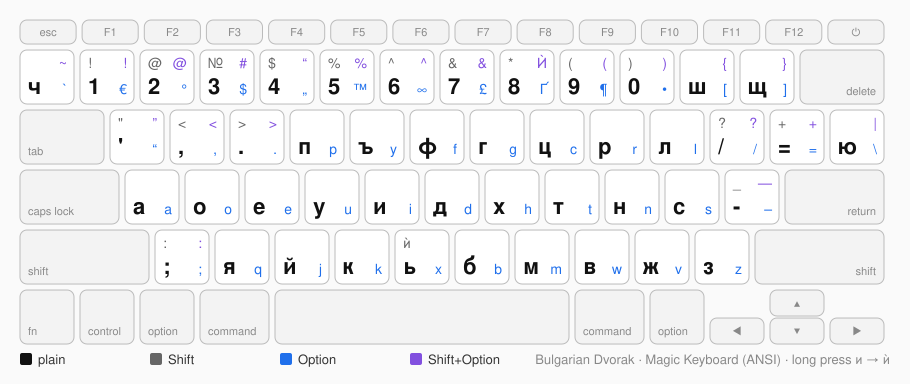
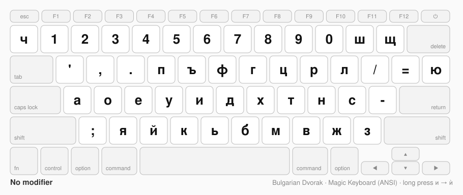
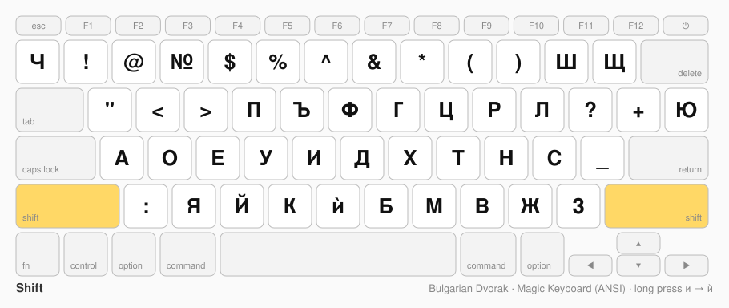
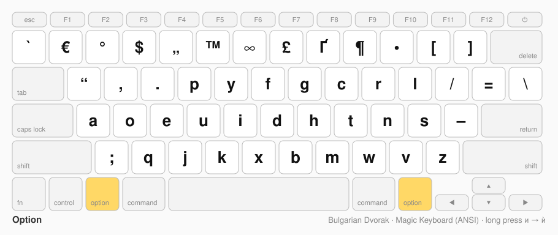
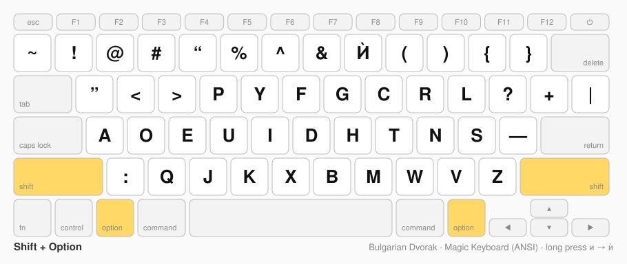
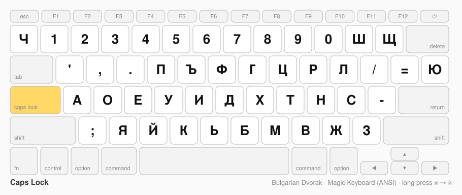
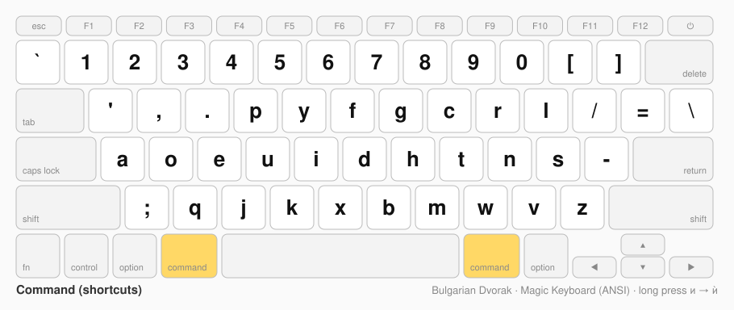
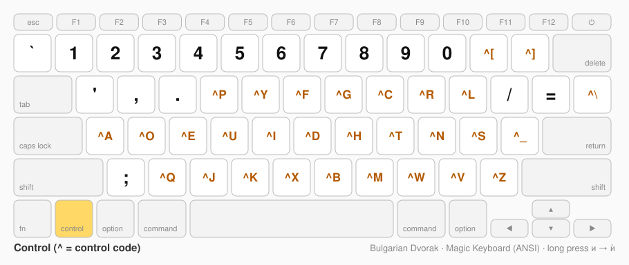

# Bulgarian Dvorak

A phonetic Bulgarian layout for macOS, built on top of Dvorak.
Rule: **Bulgarian Dvorak should be to Dvorak what Apple's "Bulgarian – QWERTY" is to U.S.**



## Layers

Held keys are yellow.

### Plain



### Shift



### Option



### Shift+Option



### Caps Lock



### Command



### Control



## Files

| Path | What it is |
|---|---|
| `Bulgarian Dvorak.bundle/` | The layout, ready to install. |
| `…/Contents/Resources/Bulgarian Dvorak.keylayout` | The layout itself (Ukelele XML). |
| `…/Contents/Info.plist` | Marks the layout as Bulgarian (`TISIntendedLanguage = bg`). |
| `images/` | Pictures of the layout (Magic Keyboard, ANSI, no numpad). |

## Install

```sh
sudo cp -R "Bulgarian Dvorak.bundle" "/Library/Keyboard Layouts/"
```

Then log out and log in again. Add the layout in
System Settings → Keyboard → Input Sources. It is listed under Bulgarian.

If you had an older bare `Bulgarian Dvorak.keylayout` installed, remove it first:

```sh
sudo rm "/Library/Keyboard Layouts/Bulgarian Dvorak.keylayout" "/Library/Keyboard Layouts/Bulgarian Dvorak.icns"
```

## Things to know

- Shift+Ь types **ѝ**, like in Apple's layout. Caps Lock still gives Ь.
  Shift+Option+8 types **Ѝ**.
- Long press и → ѝ and И → Ѝ also works, because the bundle is marked as Bulgarian.
  It works only in normal Mac text fields, not in Terminal or some Electron apps.
  Long press needs press-and-hold on. Default is on.
  To turn it on: `defaults write -g ApplePressAndHoldEnabled -bool true`
- `#` is on Shift+Option+3. Shift+3 is `№`, like in Apple's layout.
- Bulgarian quotes „…“ are on Option+4 and Shift+Option+4.
  “ ” are on Option and Shift+Option with the `'` key.
- En dash – is on Option with the `-` key, em dash — on Shift+Option with the `-` key.
- `[ ]` and `{ }` are on Option and Shift+Option with the ш and щ keys.
- The Option layers keep the Latin Dvorak letters, so Latin can be typed without changing the input source.
- `\` and `|` are on Option and Shift+Option with the ю key. Apple has ‘ ’ there, but this is the only `\` and `|`.
- Ctrl+letter gives the control code of the Dvorak Latin letter on that key, so Ctrl+C works in Terminal.
  The Control layer is the same as Apple's Dvorak.
- Command layers follow Apple's "Bulgarian – QWERTY", but with Dvorak letters:
  Command and Command+Option give Latin letters, Shift+Command gives Latin capitals and shifted symbols.
  Command alone is the same as Apple's Dvorak.
- The `.keylayout` is XML 1.1, because it has control characters.
  `xmllint` cannot read it, but Ukelele and macOS can.

## Compared with Bulgarian-Phonetic-Dvorak

[dimi-iv/Bulgarian-Phonetic-Dvorak](https://github.com/dimi-iv/Bulgarian-Phonetic-Dvorak) (last change 2020-11)
uses the same idea. Most letter keys are the same. These are the differences.

### Letters and punctuation (plain, Shift, Caps Lock)

Keys are named by their QWERTY position, with the Dvorak character in brackets.

| Key | This layout | Bulgarian-Phonetic-Dvorak |
|---|---|---|
| `-` (Dvorak `[`) | ш | / |
| `=` (Dvorak `]`) | щ | = |
| `[` (Dvorak `/`) | / | ш |
| `]` (Dvorak `=`) | = | щ |
| `'` (Dvorak `-`) | - | ч |
| `` ` `` | ч | - |
| `,` (Dvorak `W`) | в | ж |
| `.` (Dvorak `V`) | ж | в |
| Shift+3 | № | # |

- This layout follows Apple's "Bulgarian – QWERTY": W→в, V→ж, and ш щ ч on Dvorak's `[` `]` `` ` `` keys.
- Both have ѝ on Shift+ь.

### Other layers

| | This layout | Bulgarian-Phonetic-Dvorak |
|---|---|---|
| Option | Latin Dvorak letters, plus € „ “ – [ ] Ґ | US Mac symbols (å ø ∑ π …) |
| Shift+Option | Latin capitals, plus ” — { } Ѝ | Types nothing |
| `[ ]` and `{ }` | On Option | Only `[ ]`, and only with Caps Lock on. No `{ }` |
| Command | All Latin | A, S, D keys send Cyrillic а о е |
| Control | Control codes (Ctrl+C works in Terminal) | Plain Latin letters |
| Caps Lock + Shift or Option | Works | Falls back to the Control layer (Latin) |
| Space with Option, Shift+Option or Control | No-break space (Option) / works | Types nothing |
| Numpad with Option, Shift+Option or Control | Works | Types nothing |
| Packaging | Bundle marked as Bulgarian; long press works | Bare `.keylayout` with no language |

## Ideas not done yet

- « » are not on any key.
